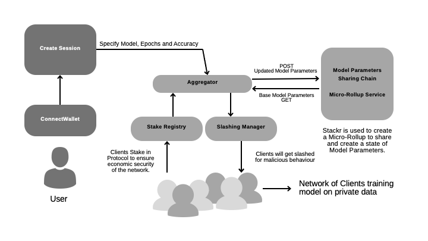

# FLockChain

A Federated Learning protocol built on Proof of Stake to establish Economic Security in the network. The architecture
is built on top of micro-rollups to provide verifiable off-chain computation for state management and providing slashing
conditions.

### Federated Learning and its Problems

Federated Learning is a privacy preserving scheme to train deep learning models. Data exists in isolated pools and clients
that are part of the network train a model with base parameters on their own individual data. They share the updated model parameters with an
aggregator that takes the federated average of this set of models. The result is going to be a new updated base model for the next 
epoch of training.
  
In a network of clients, you have to ensure that they are training models honestly so that the accuracy of the model improves.
You can have malicious clients in a network that can sabotage the network and reduce model accuracy. We can solve this problem
by leveraging a *Proof of Stake* architecture. 

## Architecture of FLockChain

</img>
 
A user can onboard on our platform and require a particular type of model by specifying their requirements like number of 
epochs or a desired accuracy of the model. The protocol we built has a set of clients that have data and they train models for our users. We have 
an aggregator that performs federated learning on this network. The clients are made to stake a set `STAKE_AMOUNT` into 
our `StakingRegistry` contract. This stake can be slashed by the `SlashingManager` which disincentivises any malicious 
behaviour. 
  
In order to ensure spam resistance on the network, the user is made to pay an initial set `BASE_FEE`. After the model reaches
a desired level of accuracy as per the user, he/she is charged accoridng to the number of Epochs and price per epoch for their model. The
fees paid by the user is distributed amongst the protcol and the clients which is managed by `RewardManager` contract.

### Arbitrum Mainnet Contracts

| Contracts | Arbitrum Mainnet |
|-----------|------------------|
| [StakingRegistry](https://github.com/BlocSoc-iitr/FLockChain/blob/main/staking_contracts/src/StakingRegistry.sol) | [0x3edc74f276ff9c476a5be63e3a5b20c616e84a43](https://arbiscan.io/address/0x3edc74f276ff9c476a5be63e3a5b20c616e84a43#code) | 
| [SlashingManager](https://github.com/BlocSoc-iitr/FLockChain/blob/main/staking_contracts/src/SlashingManager.sol) | [0x122195923d6f6d04ba748628c9678401f6c4340f](https://arbiscan.io/address/0x122195923d6f6d04ba748628c9678401f6c4340f#code) | 
| [SlashTreasury](https://github.com/BlocSoc-iitr/FLockChain/blob/main/staking_contracts/src/SlashTreasury.sol) | [0x8709ea3d5680b0de65d716f87721d07c0fc46ff3](https://arbiscan.io/address/0x8709ea3d5680b0de65d716f87721d07c0fc46ff3#code) | 
| [RewardManager](https://github.com/BlocSoc-iitr/FLockChain/blob/main/staking_contracts/src/RewardManager.sol) | [0x1fd53deeeb666f07ce0dd2b905535cb45d4294c3](https://arbiscan.io/address/0x1fd53deeeb666f07ce0dd2b905535cb45d4294c3#code) | 
| [RewardTreasury](https://github.com/BlocSoc-iitr/FLockChain/blob/main/staking_contracts/src/RewardTreasury.sol) | [0xd2c5b64acfffa8f1377b79d929f781582d95cbf3](https://arbiscan.io/address/0xd2c5b64acfffa8f1377b79d929f781582d95cbf3#code) | 

### Scroll Sepolia Contracts

| Contracts | Scroll Sepolia |
|-----------|----------------|
| [StakingRegistry](https://github.com/BlocSoc-iitr/FLockChain/blob/main/staking_contracts/src/StakingRegistry.sol) | [0x46de9190a00a27c1a8f7cf760cb3ad8625e48556](https://sepolia-blockscout.scroll.io/address/0x46de9190a00A27c1a8F7Cf760cb3Ad8625E48556/contracts#address-tabs) |
| [SlashingManager](https://github.com/BlocSoc-iitr/FLockChain/blob/main/staking_contracts/src/SlashingManager.sol) | [0xfdf49cead5fb56a740964751e474ecd730dce40f](https://sepolia-blockscout.scroll.io/address/0xfdf49cead5fb56a740964751e474ecd730dce40f/contracts#address-tabs) |
| [SlashTreasury](https://github.com/BlocSoc-iitr/FLockChain/blob/main/staking_contracts/src/SlashTreasury.sol) | [0x88764ee0ad40004621194f27b9d6d77ce090ad0c](https://sepolia-blockscout.scroll.io/address/0x88764ee0ad40004621194f27b9d6d77ce090ad0c/contracts#address-tabs) |
| [RewardManager](https://github.com/BlocSoc-iitr/FLockChain/blob/main/staking_contracts/src/RewardManager.sol) | [0x8aafabc0711cd5508f1b775e78bb40cd6296cfe5](https://sepolia-blockscout.scroll.io/address/0x8aafabc0711cd5508f1b775e78bb40cd6296cfe5/contracts#address-tabs) |
| [RewardTreasury](https://github.com/BlocSoc-iitr/FLockChain/blob/main/staking_contracts/src/RewardTreasury.sol) | [0x7bb3af97694802b4665cf74079376d2167bf03d5](https://sepolia-blockscout.scroll.io/address/0x7bb3af97694802b4665cf74079376d2167bf03d5/contracts#address-tabs) |

### Linea Testnet Contracts

| Contracts | Linea Testnet |
|-----------|---------------|
| [StakingRegistry](https://github.com/BlocSoc-iitr/FLockChain/blob/main/staking_contracts/src/StakingRegistry.sol) | [0x8aafabc0711cd5508f1b775e78bb40cd6296cfe5](https://explorer.goerli.linea.build/address/0x8AaFabC0711Cd5508f1B775e78BB40cd6296cFe5/contracts#address-tabs) |
| [SlashingManager](https://github.com/BlocSoc-iitr/FLockChain/blob/main/staking_contracts/src/SlashingManager.sol) | [0xd043f19c25a83903788c95ce39a8be0064896a4e](https://explorer.goerli.linea.build/address/0xd043f19c25a83903788c95ce39a8be0064896a4e/contracts#address-tabs) |
| [SlashTreasury](https://github.com/BlocSoc-iitr/FLockChain/blob/main/staking_contracts/src/SlashTreasury.sol) | [0x7bb3af97694802b4665cf74079376d2167bf03d5](https://explorer.goerli.linea.build/address/0x7bb3af97694802b4665cf74079376d2167bf03d5/contracts#address-tabs) |
| [RewardManager](https://github.com/BlocSoc-iitr/FLockChain/blob/main/staking_contracts/src/RewardManager.sol) | [0x79bd4b4c662810f049171fdeb3563826b12df65b](https://explorer.goerli.linea.build/address/0x79bd4b4c662810f049171fdeb3563826b12df65b/contracts#address-tabs) |
| [RewardTreasury](https://github.com/BlocSoc-iitr/FLockChain/blob/main/staking_contracts/src/RewardTreasury.sol) | [0x7d1bb6b83edcb9378d3c4647e218bcb1dea19cce ](https://explorer.goerli.linea.build/address/0x7d1bb6b83edcb9378d3c4647e218bcb1dea19cce/contracts#address-tabs) |

### zkEVM Testnet Contracts

| Contracts | zkEVM Testnet |
|-----------|---------------|
| [StakingRegistry](https://github.com/BlocSoc-iitr/FLockChain/blob/main/staking_contracts/src/StakingRegistry.sol) | [0x7bb3af97694802b4665cf74079376d2167bf03d5](https://testnet-zkevm.polygonscan.com/address/0x7bb3af97694802b4665cf74079376d2167bf03d5) |
| [SlashingManager](https://github.com/BlocSoc-iitr/FLockChain/blob/main/staking_contracts/src/SlashingManager.sol) | [0xe6dd79c6d7c1b959e6dd87838ed8ca571c632172](https://testnet-zkevm.polygonscan.com/address/0xe6dd79c6d7c1b959e6dd87838ed8ca571c632172)
| [SlashTreasury](https://github.com/BlocSoc-iitr/FLockChain/blob/main/staking_contracts/src/SlashTreasury.sol) | [0xd043f19c25a83903788c95ce39a8be0064896a4e](https://testnet-zkevm.polygonscan.com/address/0xd043f19c25a83903788c95ce39a8be0064896a4e)
| [RewardManager](https://github.com/BlocSoc-iitr/FLockChain/blob/main/staking_contracts/src/RewardManager.sol) | [0x7d1bb6b83edcb9378d3c4647e218bcb1dea19cce](https://testnet-zkevm.polygonscan.com/address/0x7d1bb6b83edcb9378d3c4647e218bcb1dea19cce)
| [RewardTreasury](https://github.com/BlocSoc-iitr/FLockChain/blob/main/staking_contracts/src/RewardTreasury.sol) | [0x79bd4b4c662810f049171fdeb3563826b12df65b](https://testnet-zkevm.polygonscan.com/address/0x79bd4b4c662810f049171fdeb3563826b12df65b)

### Micro-Rollup Architecture

FLockChain uses Stackr to develop a micro-rollup on top of the network of clients. This rollup will act as a Model Parameters
Sharing (MPS) Chain which will hold the state of the model parameters for each epoch. This is essential as their needs to be
a verifiable track of the updated parameters shared by each client.
  
The rollup architecture also allows for off-chian verifiable computation where the slashing conditions are implemneted.
The State Transition function of the rollup does the slashing checks offchains and maintains a state of the model parameters of
a client as well as whether or not it should be slashed for that epoch. The aggregator fetches the state after each epoch and
if a client is malicious, it calls the `SlashingManager` and slashes the stake of that client.

### Slashing Conditions

The Slashing conditions that are implemneted in the rollup check for correlation between the base and the trained models and the 
existence of outliers in the set of clients.
The Krum function is used to set a score for each of the clients for that epoch. It is the sum of squared distances of the
tensor value of that client with all other clients. The assumption of this function is that the majority of clients are honest
and hence will have model parameters which are very similar to each other. The tensor value associated with a sharp contarst 
in Krum score is likely a bad actor. 
  
Apart from outliers that reduce accuracy, their also exists free riders that may not train the model but wish to reap the benefits
of the network. We have implemented checks that mesure the correlation between the model parameters of the previous and current 
epochs. If they are quite similar, the client has likely made no significant improvements and hence will have a to face a penalty.
